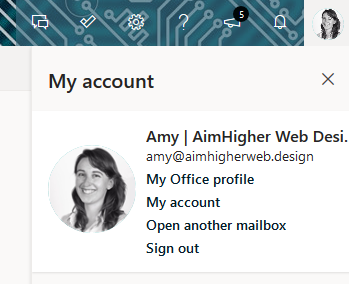
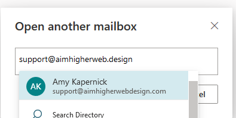

A shared mailbox is separate from your main email, but you use that account to login with it.

## Accessing a shared mailbox online

-   Login to your emails at <a href="https://outlook.office365.com" target="_blank">https://outlook.office365.com</a>
-   Click on your profile image/placeholder in the top right corner of the screen and click **Open another mailbox**

-   In the dialog box, enter the email for the shared mailbox you're trying to access, eg. `support@aimhigherweb.design` and click **Open**

-   This will open the shared mailbox inbox in a new tab

If you're unable to access the mailbox, please speak to your administrator or [contact us](/contact)

## Accessing a shared mailbox on your phone

If you use the Outlook email app on your phone, you'll be unable to access a shared mailbox on there as they don't support them (I know right, works with all non-Microsoft apps 🤦‍♀️)

-   Open your email app on your phone (I recommend using Gmail)
-   Tap the profile image in the top right corner and press **Add another account**
-   Choose **Other** or **IMAP** as the account type
-   Enter the email address of the shared mailbox and press **Manual Setup**
-   Select **Personal (IMAP)** as the account type
-   Enter the password you use to access your emails
-   Use the following for the **Incoming server settings**:

|       | Username                         | Password         | Server                | Port | Encryption/Security |
| ----- | -------------------------------- | ---------------- | --------------------- | ---- | ------------------- |
|       | youremail@domain.com\mailboxname | `YourPassword`   | outlook.office365.com | 993  | SSL/TLS             |
| _eg._ | amy@aimhigherweb.design\support  | \*\*\*\*\*\*\*\* |                       |      |                     |

-   Use the following for the **Outgoing server settings**:

|       | Username                | Password         | Server             | Port | Encryption/Security |
| ----- | ----------------------- | ---------------- | ------------------ | ---- | ------------------- |
|       | youremail@domain.com    | `YourPassword`   | smtp.office365.com | 587  | STARTTLS            |
| _eg._ | amy@aimhigherweb.design | \*\*\*\*\*\*\*\* |                    |      |                     |
