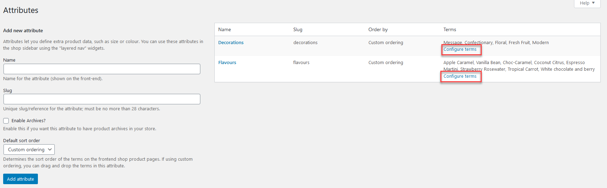
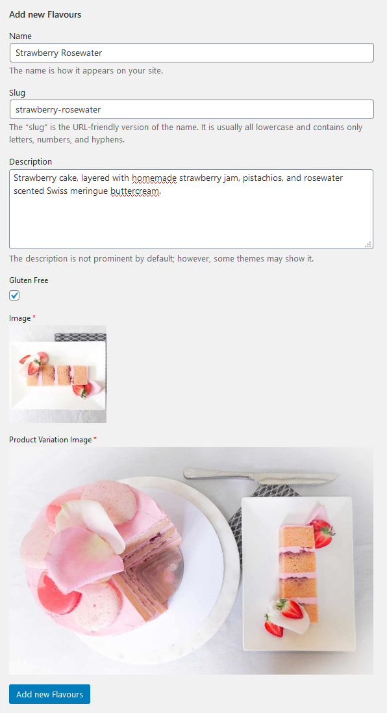
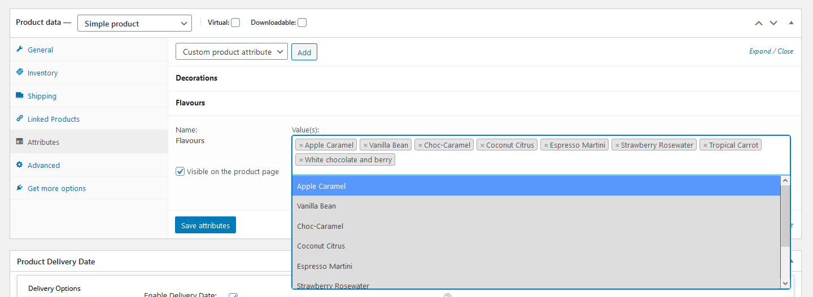
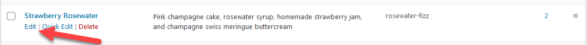
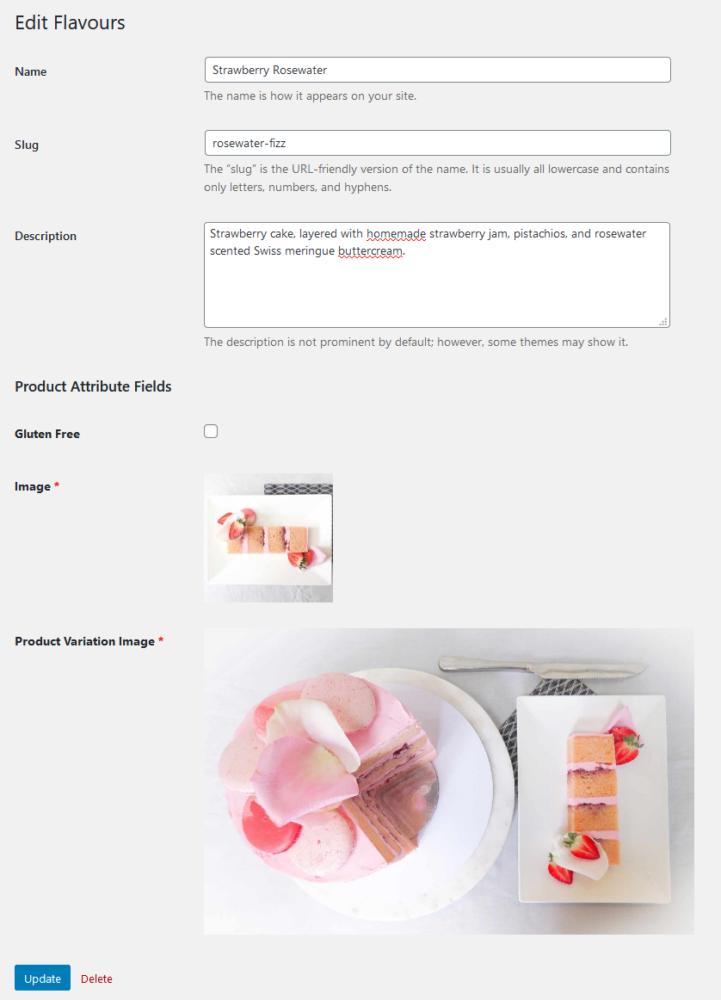

To add/edit a flavour/decoration style, navigate to **Products** -> **Attributes** in the side admin menu. Click **Configure terms** on the attribute you're wanting to add a new option to or edit an existing one for.

## Adding a new option

To add a new option, fill in the form on the side with information about the new option.

* The **name** will be what appears on the website, a user friendly version of the name, eg. *Strawberry Rosewater*
* The **slug** will be used on the back end of the order process, and should be all lowercase, with hyphens replacing any spaces, eg. *strawberry-rosewater*
* The **description** will appear when the user selects the option during the order process, and should be short, no more than one paragraph
* If the cake cannot be made **Gluten Free**, ensure the checkbox is not selected, this ensures that users can't order a gluten free cake
* The first **image** should be a small square image, this appears in the order form
* The second **Product Variation Image** appears at the top of the page when a user selects the option, and is a larger view of the flavour

Once you've filled in the information, click **Add new Flavours** to save the new flavour.

When adding a new flavour/decoration style, you need to make it available on the products. Navigate to **Products** -> **All Products** and select one of the cakes (this needs to be done individually).

Scroll down to the **Product data** section and click on the **Attributes** tab. Click on the attribute you're adding to, and add the new option (you can start typing and select an option, or scroll in the list provided).

Click **Save Attributes** and repeat for the other cakes.

## Editing an existing option

To edit an existing option, hover over the option in the list to the side, and click **Edit**

Edit/replace any details that need changing and click **Update** to save the changes. Note, the fields and where they're used on the side are below:

* The **name** will be what appears on the website, a user friendly version of the name, eg. *Strawberry Rosewater*
* The **slug** will be used on the back end of the order process, and should be all lowercase, with hyphens replacing any spaces, eg. *strawberry-rosewater*
* The **description** will appear when the user selects the option during the order process, and should be short, no more than one paragraph
* If the cake cannot be made **Gluten Free**, ensure the checkbox is not selected, this ensures that users can't order a gluten free cake
* The first **image** should be a small square image, this appears in the order form
* The second **Product Variation Image** appears at the top of the page when a user selects the option, and is a larger view of the flavour

