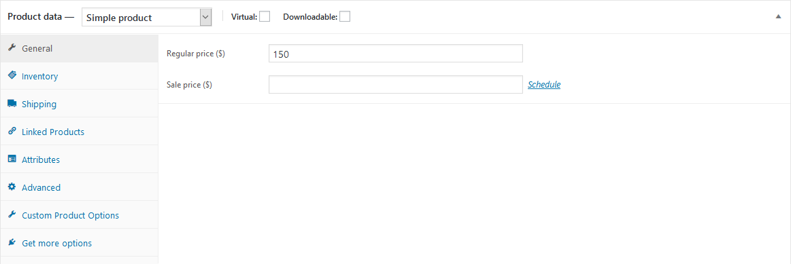
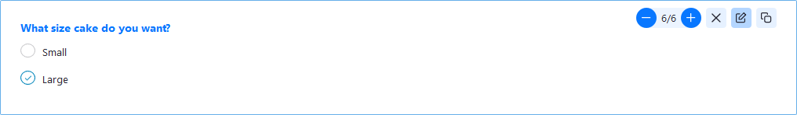
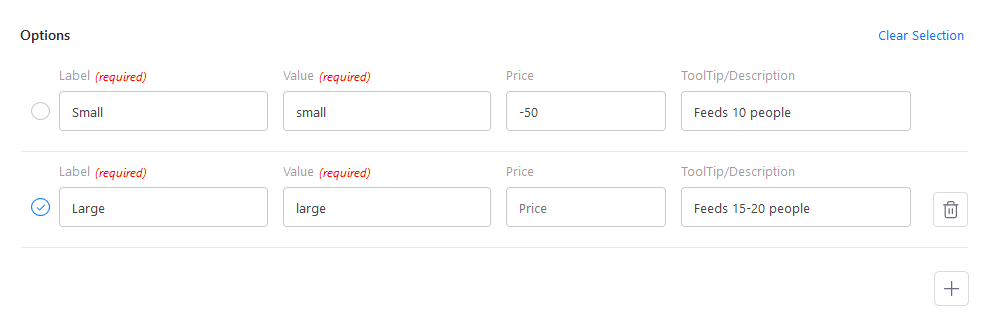

To update the prices of the cakes, there are two different locations that this needs to be done.

## Large Cake Price

This can be edited under **Products** -> **All Products** -> **Cake** and editing the **Regular price** in the **Product data** section.

Note: the small cake is set up as a variation of the large cake, and subtracts an amount from the price (eg. - $50). If the large cake price changes, but the small one doesn't, you'll need to update both so they are the right price.

## Small Cake Price

This is set up as a variation of the large cake, and may need to be changed if the price of the large cake changes but the small one should stay the same.

This price can be changed under **Products** -> **Custom Product Options** -> **Cake Order**.

On the form, edit the question for _What size cake do you want?_

Under the **Options** section, change the price next to the _Small_ option so that it reflects the price difference between the small and large cake (eg. -50 for the small cake being $50 less than the large cake).

