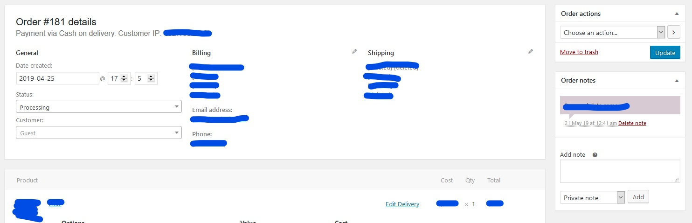

You can view all orders from your website in the WordPress admin dashboard, by navigating on the side menu to **WooCommerce** → **Orders**.

You can view the details for each order on the order details page, and here you can update the status of the order, for example once you've delivered the order or if you need to cancel it.

You can also resend the order details to either yourself or the customer under **Order actions** or add an **Order note**

