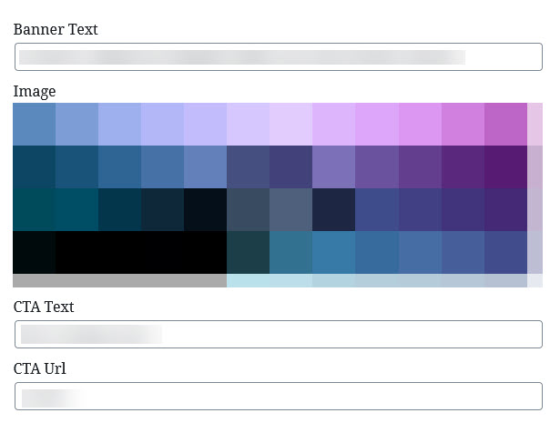
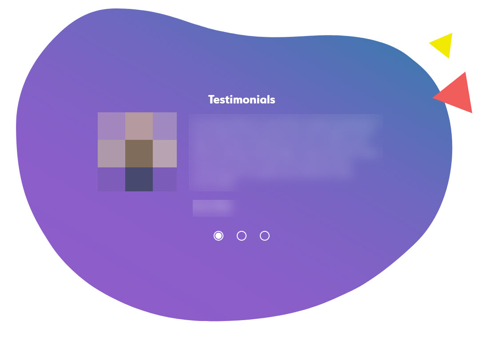
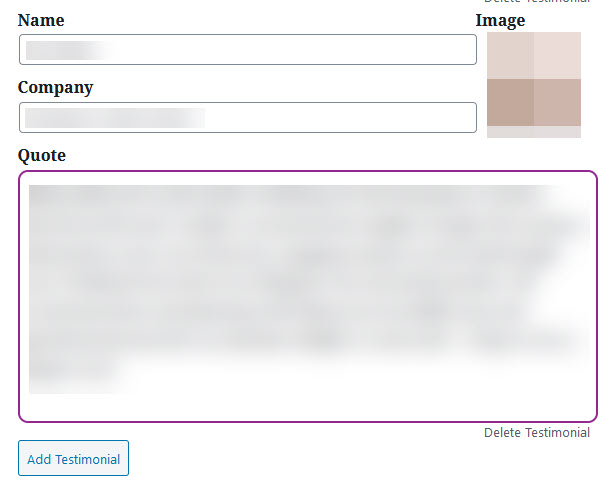
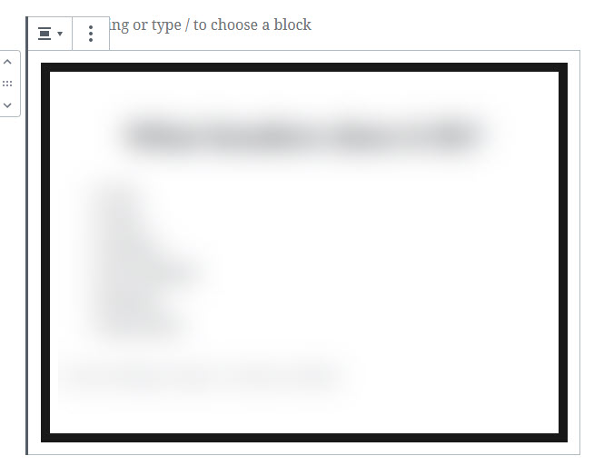
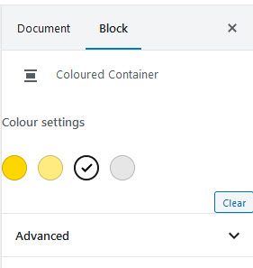
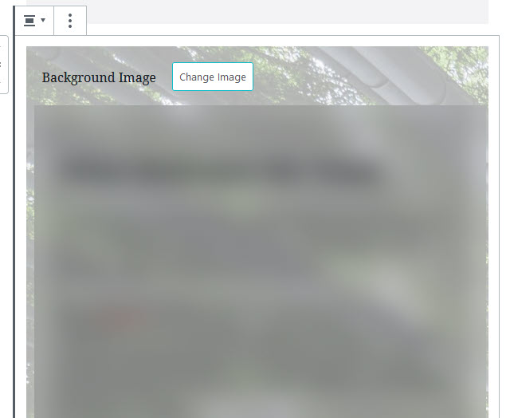
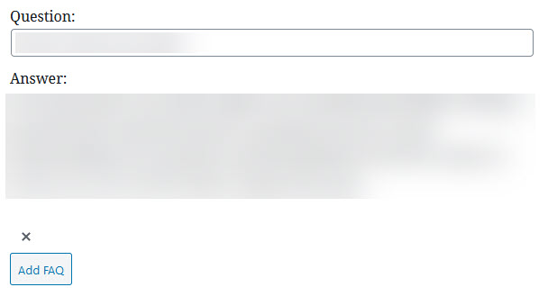
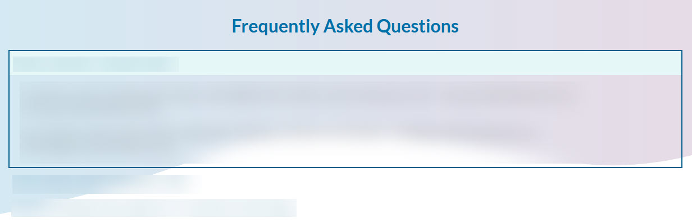

If you have an updated/new website, you'll be using the new Gutenberg editor on your WordPress site. For more information about using the Gutenberg editor, see the [Editing Page Content with Gutenberg](/docs/wordpress/editing-page-content-with-gutenberg) guide.

Your website may have additional custom blocks or may have slightly different blocks, but these are some of the custom blocks you can expect to find on your site:

## Banner
The banner block will typically be used at the top of your homepage.

Depending on your variant, this block will include banner text (the text  that appears on the banner), an image for the banner background and text and a link for the call to action (CTA) button. If this button is going to another page on your site (eg. the contact page), recommended to use a relative url (eg. `/contact`) rather than an absolute url (eg. `https://mywebsite.com/contact`).

## Testimonials

The testimonials block allows you to add a slider with multiple customer testimonials (may include a picture of the customer).

This block will take a customer name and company, and may include an image/logo for the customer. It will also include a quote (multi-line/paragraphs allowed).

This block will allow adding several testimonials (clicking the **Add Testimonial** button) which will render as a slider on the website (testimonials can be navigated through using the radio buttons). You can also remove testimonials by clicking the **Delete Testimonial** button under a given testimonial.

## Coloured Container

The coloured container block allows you to create a section on the website with a coloured background, using pre-defined brand colours as background options.

**Note:** additional changes may need to be made depending on the background colour to change the text colour inside the container (eg. if it's a dark background colour).

## Image Container

Similar to the coloured container, the image container block allows you to create a section on the website with an image background.

Select/change the background image by clicking the **Change Image** button.

**Note:** additional changes may need to be made to ensure that the content inside the container can be read in front of the image.

**Note:** watch the amount of content you put in the container, if you put too much content inside, the image may not be visible properly.

## FAQ

The FAQ block allows adding multiple FAQs, which are rendered as expandable/collapsible questions on the page.

Similar to the Testimonials block, you can use the **Add FAQ** button to add additional FAQs, and the **X** button below each FAQ to remove one of them.