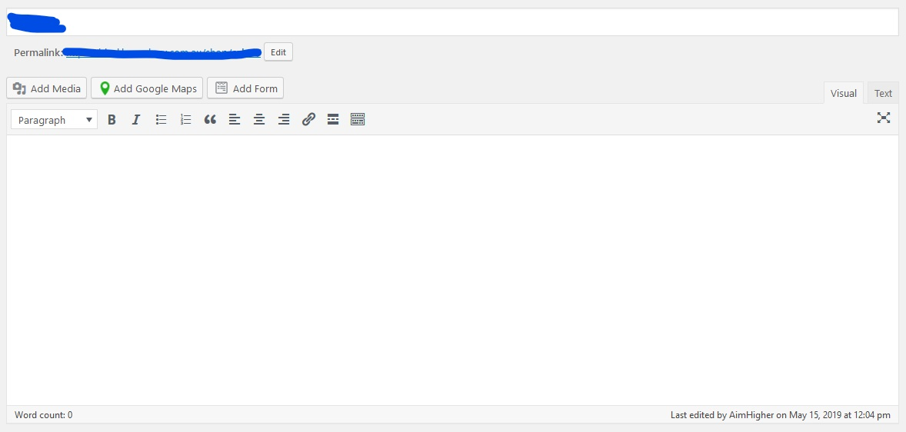
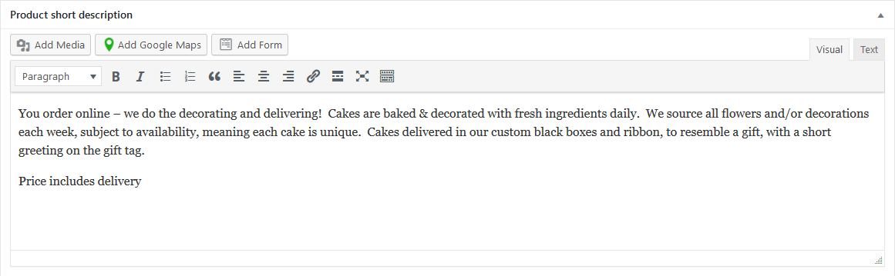

You can edit product details by navigating to **Products** in the side navigation menu and clicking on the product you want to edit.

Depending on your store setup, there may be additional customisation options but the main ones are:

## Product Description

This may or may not be used (if it's empty, your store isn't using it) and is right at the top of the edit product screen

## Short Description

This is likely the main place for information about each product. This is right at the bottom of the page and where most of the product information comes from.

## Product Image and Gallery

The product image is the main image for the product (ie. shown in shop pages and as the big main image on the product page) and can be edited in the sidebar.
You may also have a product gallery where you can include additional photos of each product.

