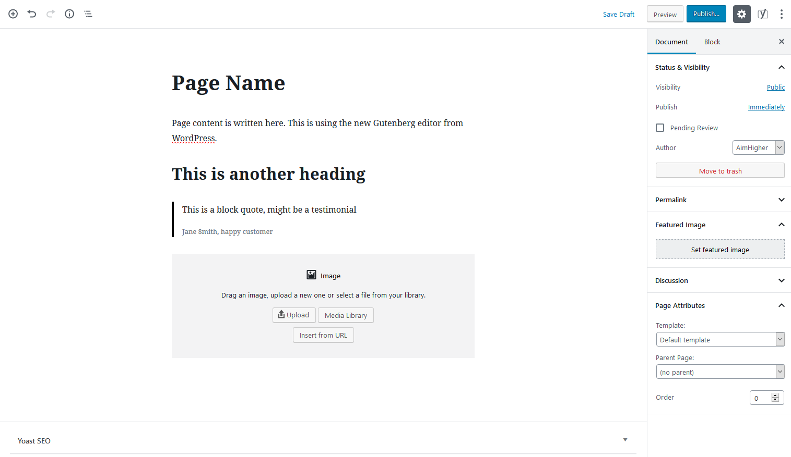
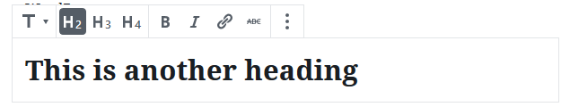
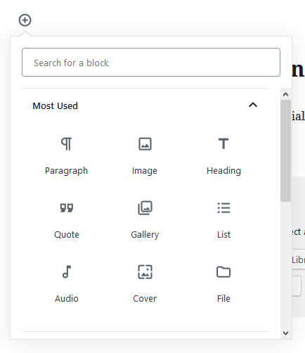

If you have an updated/new website, you'll be using the new Gutenberg editor on your WordPress site. The Gutenberg editor allows creating custom content blocks and gives a good visual editing experience as well as a good developer experience. When editing a page, you can add new content blocks by typing or clicking the **+** icon to add a new block.

## Main Content Area

This is where most of the page content comes from. Here you can change the page name and any content that appears on the page (including images).

You can add headings and block quotes here (a block quote will be a break out quote with extra styling on your website) as well as write all your content for the page.

## Sidebar

### Featured Image

This is where you can set or change the featured image for a page, this may appear with the content, as a banner or big at the top of the page.

### Page Attributes

**Template** - Your site may have multiple templates, you can change these here
**Parent Page** - If a page is the child of another, eg. `/about/our-team`, you can select the parent page here.

## Publish

Once you're done, click the **Publish** or **Update** button in the top right corner of your screen.
