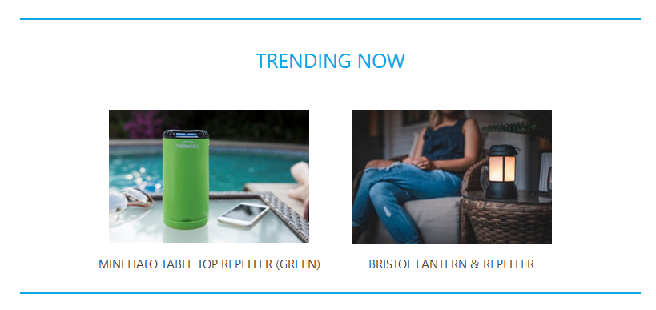
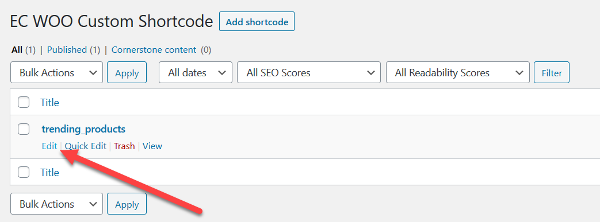

The **Trending Now** section shows products set in a shortcode. You can edit these in the WordPress admin console.

Navigate to **EC WOO Custom Shortcode** in the side admin menu.

Edit the **trending_products** shortcode.

You can edit the content that appears in the *Trending Products* section using the WordPress editor. Here you can replace the images, product name and link through to the relevant products.