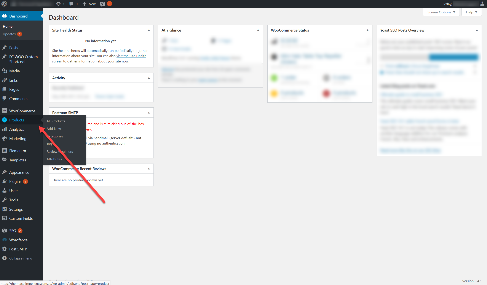
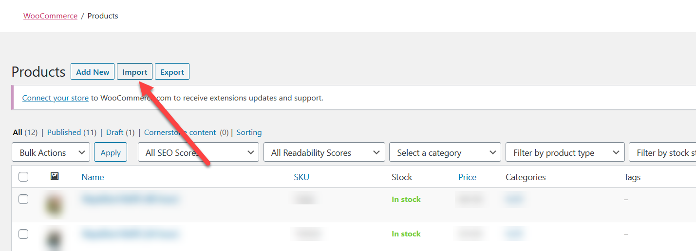
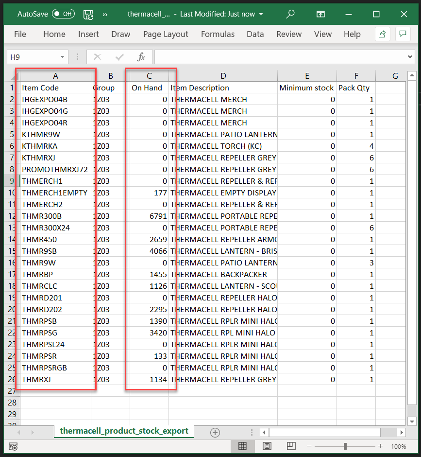
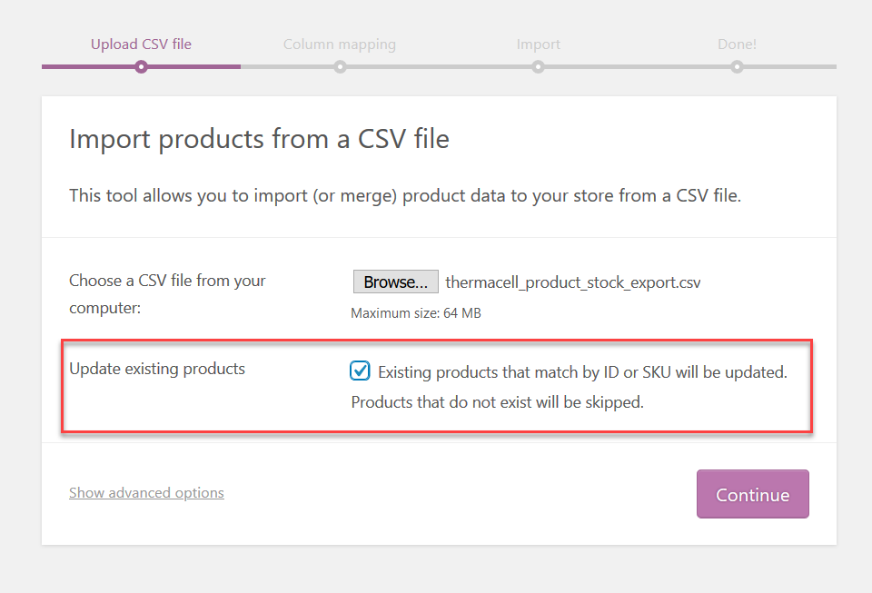
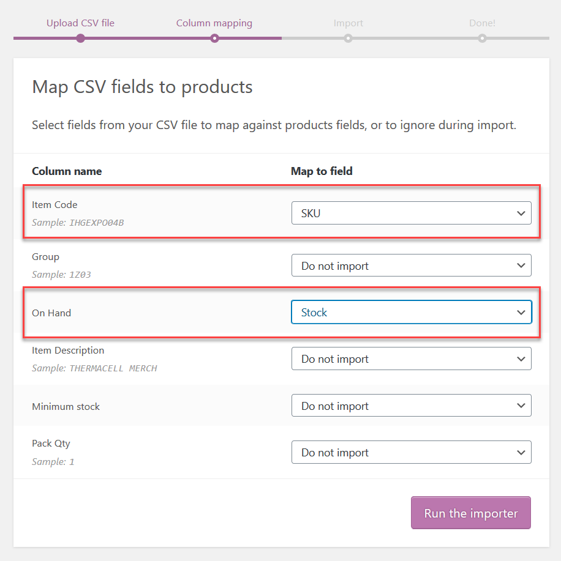

Navigate to **Products** in the admin menu.

Click **Import**

The export of stock levels you're using must be in CSV format, and must have a column with the item SKU and a column with the current stock levels (the column heading doesn't matter, but make sure you know which column is which).

Select the file to upload, and make sure you check the box to update existing products. Then click **Continue**.

From the dropdowns, match the columns for **SKU** and **Stock** fields, then click **Run the importer**.

