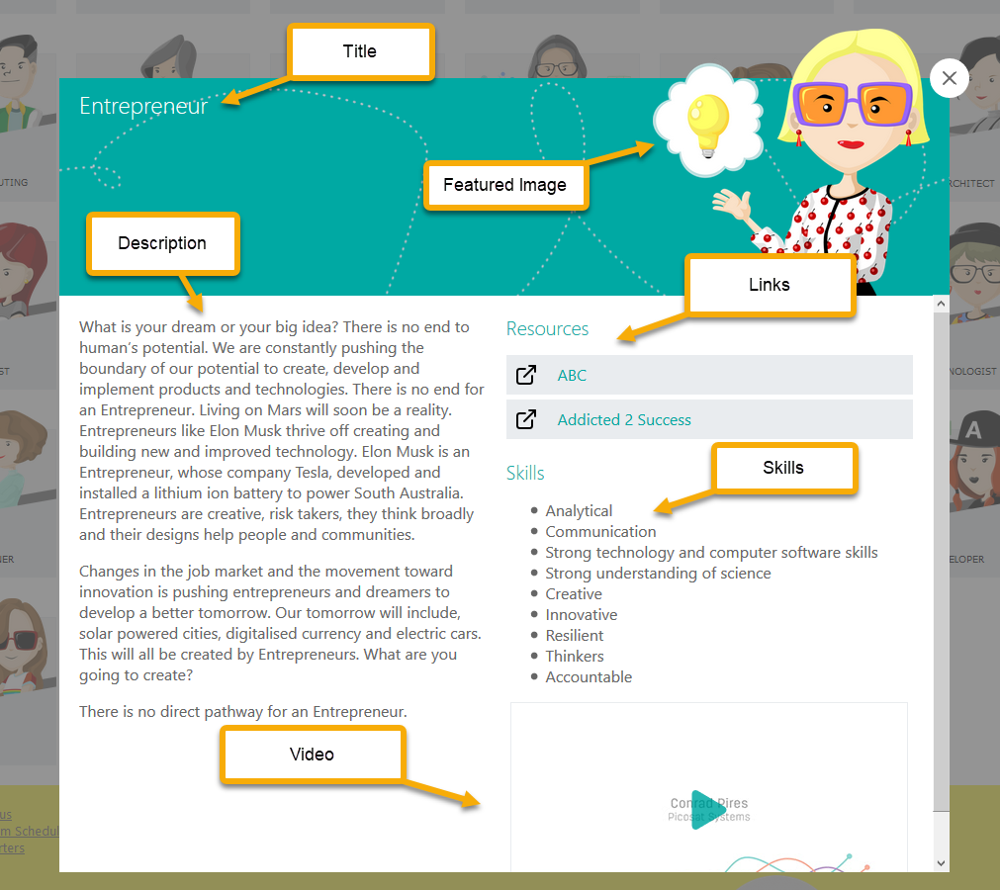
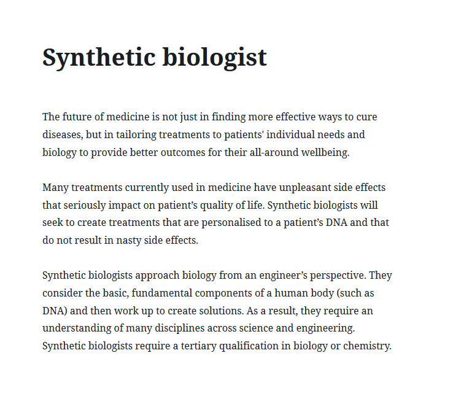
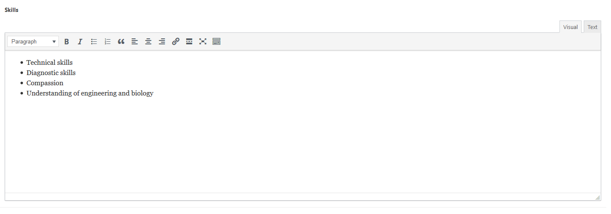
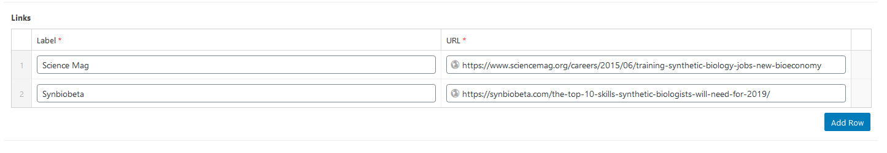
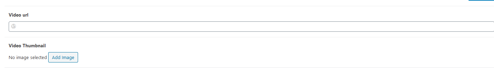

The different Careers are a custom post type, and are accessible from the **Careers** option in the side admin menu. From here they can be edited the same as pages (clicking to edit), or you can choose **Careers** -> **Add New** in the side menu, or the **Add New** button at the top of the *Careers* page to create a new career.
Each career requires several bits of information to be set so that they are accessible on the website and so that it build properly.

## Title and Description
***Both of these fields are required***

The title and description for each career can be edited the same as when editing a page, although it's recommended to keep the content fairly simple (no adding custom blocks, media or embeds).

## Featured Image
***This field is required***

Further down the page, below the content, is a field for the *Feature Image*, this is the image for the career profile that is displayed on the block in the overview page, as well as appearing in the popup. This is using the WordPress media upload, you can click to **Add Image**, or if there is already one there you can **Remove** it and add a new one (the **edit** button will not allow you to replace the image, just edit the meta data for the existing image).

## Skills
***This field is required***

Below the featured image, there is a WYSIWYG (what you see is what you get) editor for inputting the skills for the career. Although you can apply formatting here, it's recommended to just use a bulleted list here to keep it standard with the rest of the content.

## Links
***This field is optional***

Below the skill section, there is a custom field to add links to external resources. These are optional, but for each link you must add a *Label* and a *URL*. The label is the text that will appear, and should suggest what the link is about, and the URL is the page that is being linked to.

## Alignments
***This field is required***

In the sidebar, you can select which alignments are relevant for a given career, these are required so that the career appears in the results under a specific subject area.

## Video
***This field is optional***

If you'd like to link to a video on youtube, you can include the *URL* and a *Thumbnail* image in the section below the links. If you want to include a video, you must include a url and a thumbnail image.

