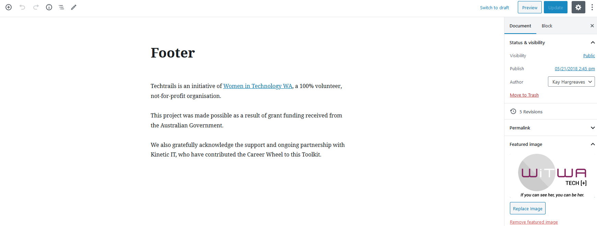
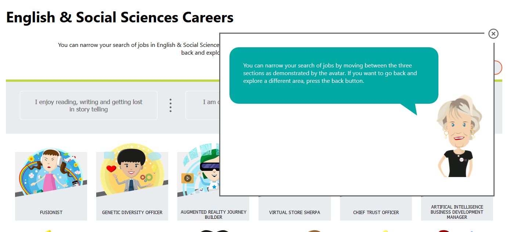

There are several other areas of content on the website that is editable in WordPress backend.

## Footer Content
The block of text that is in the footer is under the **Footer** page, you can edit the text there (**Pages** -> **Footer**).

The WiTWA logo that appears in the footer is the **Featured Image** on the **Footer** page. You can change the logo by replacing the featured image with the new logo.

The block of text can be changed by editing the content on this page, however the copyright text (eg. © 2020, Techtrails) is not edited here, it's coded in the template with an auto-updating date.

## Popup Avatar

When a user first searches for careers, it displays a popup with a randomly assigned WiTWA avatar.

You can edit the text that appears in the speech bubble here, by editing the content on the **Avatar Popup** page (**Pages** -> **Avatar Popup**).

The images that appear cannot be edited here though, they are hardcoded into the template.