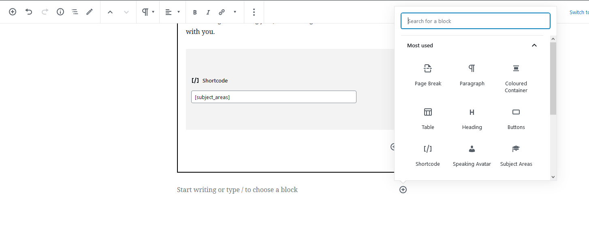
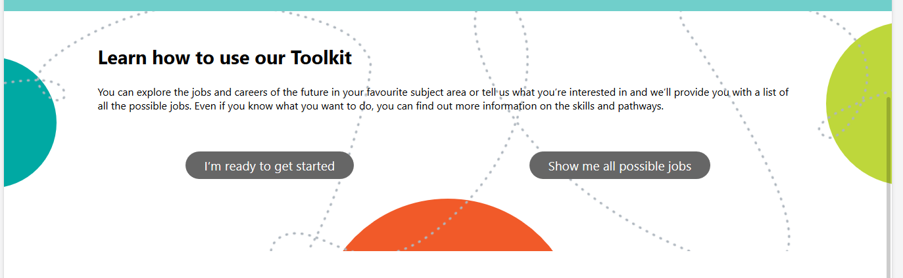
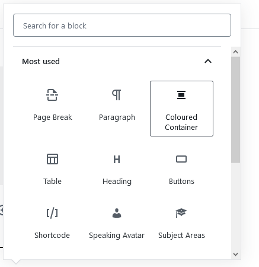
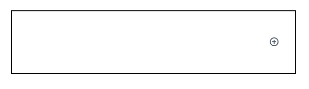
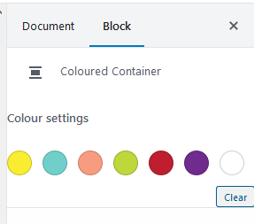
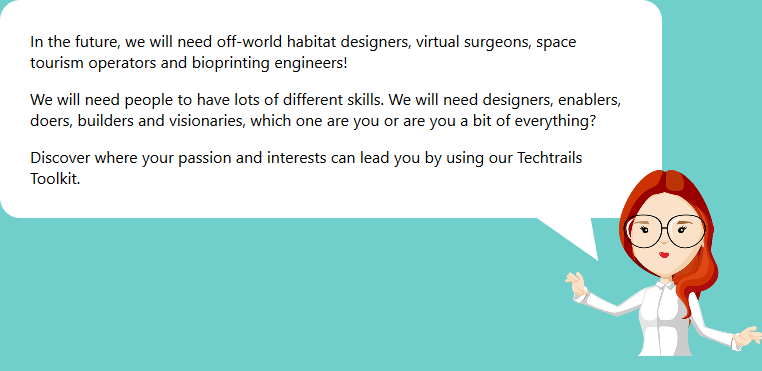
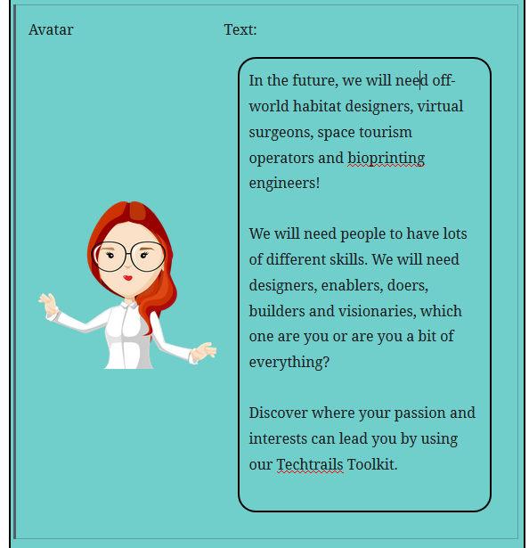

There are several custom Gutenberg blocks build for Techtrails Toolkit, for more information on using the Gutenberg editor, read the [*Editing Page Content with Gutenberg*](/docs/wordpress/editing-page-content-with-gutenberg) document.

There are 2 custom blocks that have been built for Techtrails Toolkit, which are the **Speaking Avatar** block and the **Coloured Container**.

## Coloured Container
The coloured container block has been created for use on the homepage, to have coloured or patterned background of content. You can place more content blocks inside the coloured container block.

- Add the **Coloured Container** block from the Gutenberg editor

- This is a container block, and has it's own **+** button to add new blocks inside it, or you can drag existing blocks into the container.

- In the sidebar, there are controls to change the background colour of the block. These are the defined WiTWA brand colours to use (although some of them are more muted alternatives). By default (or by clearing the colour), it will add the swirls of dots and coloured circles. *Note*: white will create a plain white background, not the dots and circles

## Speaking Avatar
The speaking avatar block add text to the page in a speech bubble, and is paired with an avatar image. It's not recommended to put too much text here, but use it to break a large block of text up.

- Add the block in the Gutenberg editor
- Upload an avatar image, and add text to the block
  
- It's recommended to use a small or cropped avatar image, otherwise you'll end up with too much blank space
- You can add multiple paragraphs to the text, but no other formatting (eg. bold and italics) or links