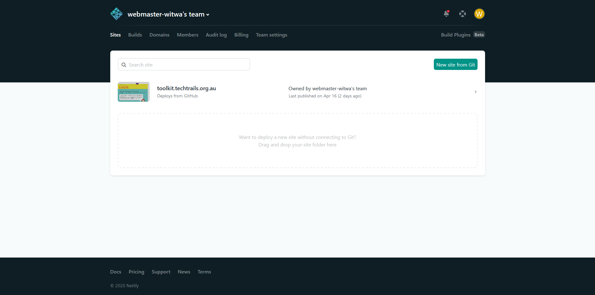
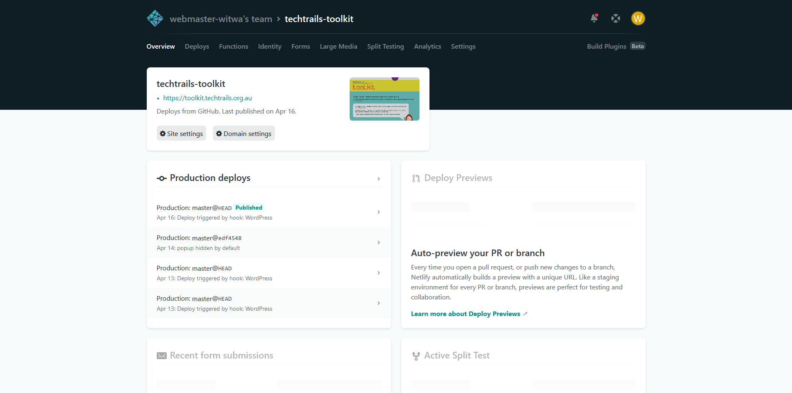
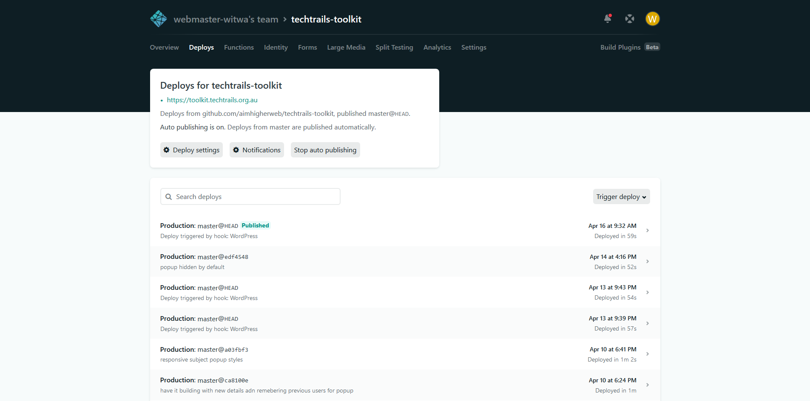

This website is currently built with [Gatsby](https://www.gatsbyjs.org/), which is a static site builder based on React and uses WordPress as a Headless CMS to fetch the content. Most of the content is accessible and editable within WordPress, and when content is saved there, it triggers the website to rebuild and update.

The live website is currently hosted on Netlify, which is a free static site host and provides easy to use continuous deployment to update and rebuild the website when changes are made. You can login to Netlify at <https://app.netlify.com> using the login details provided to you.

By clicking on the Techtrails toolkit site, you can view the site dashboard, and see if there are any issues with the past website builds.

By clicking on **Deploys** in the top menu, you can view the entire build history, and check if a recent build has failed or if it is still running.

If you have any issues with the website building, and it continues to fail even when manually triggering a build by clicking **Trigger deploy**, it's recommended to speak with a developer to investigate further.

## Website Code

The website is built from 3 different code repositories. All of these code repositories are public and can have pull requests submitted for changes, or can be forked to be used elsewhere.

The front end of the website (the Gatsby site which is hosted on Netlify), builds from the repository <https://github.com/aimhigherweb/techtrails-toolkit>

The custom WordPress theme is from the repository <https://github.com/aimhigherweb/techtrails-toolkit-wordpress-theme>

The plugin for the custom Gutenberg blocks is from the repository <https://github.com/aimhigherweb/techtrails-toolkit-gutenberg-blocks>