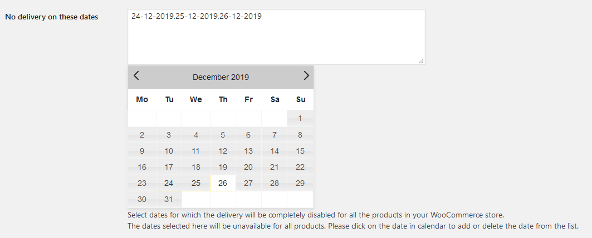

You can edit the delivery date settings for your store in the WordPress Admin by navigating to **Product Delivery Date** -> **Settings** in the side navigation menu. Most of these settings should stay as-is, but there are a couple that can be changed as required.

## Global Delivery Settings

**Show "Add to Calendar" button on Order Received page** - Currently it's set up so that customers get prompted to add their delivery period to their calendar. This is useful so they have it saved and hopefully don't forget. This can be disabled if you'd prefer not to do this.
**Send delivery information as attachments (ICS files) in email notifications** - Similar to above, this also sends a calendar event with the order confirmation.
**No delivery on these dates** - This is a good place to block out your holidays, for example it's currently set so that no one can order a product to be delivered on Christmas Eve, Christmas Day and Boxing Day. When you're taking holidays (or if you don't want to deliver on certain public holidays), this is where you can block off the days you're away.

**Minimum number of days for rescheduling** - Currently people must give at least 2 days notice when rescheduling their order, this can be changed here.

## Field Labels

Here you can change the various labels/terminology being used for delivery details around the website

## Per Product

You can edit more delivery date settings by navigating to **Products** and selecting the product there. Scroll down the page to the **Product Delivery Date** panel to edit these settings.

### Delivery Options

Currently these are set up to deliver every weekday, with a maximum of 5 deliveries per day. It's currently set to auto-create delivery spots for you, so don't edit these unless you're planning to change them or add new ones (eg. Saturday morning) as it will create duplicates.

### Settings

This is set up so that people must select a delivery date when placing an order.
**No delivery on these dates** - I'd recommend not blocking the dates out here, as if you add another product these dates won't apply to it.

### Delivery Time Period

**Minimum Delivery preparation time (in hours)** - How far in advance to people need to place an order
**Number of Dates to choose** - This is how far in advance people can place orders.

### Manage Dates, Time Slots

Here you can see what time slots you have coming up, this will most of the time be the normal recurring ones, but you may also like to offer a once off additional timeslot (eg. the Saturday morning before Christmas)

### Delivery Charges

If you'd like, you can add additional charges for certain days, eg. a surcharge for a Saturday delivery or for a public holiday.
